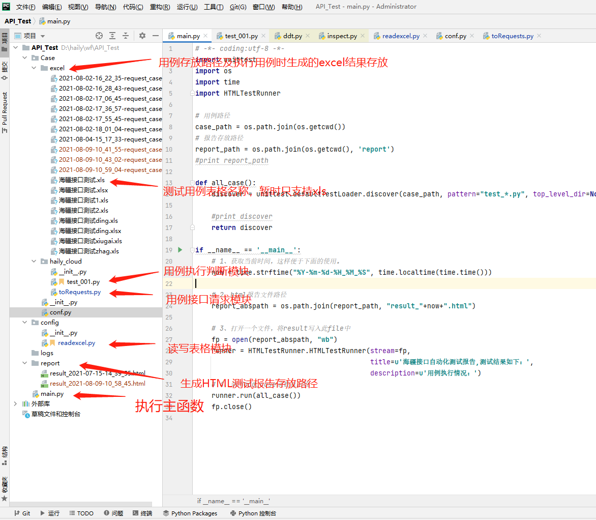
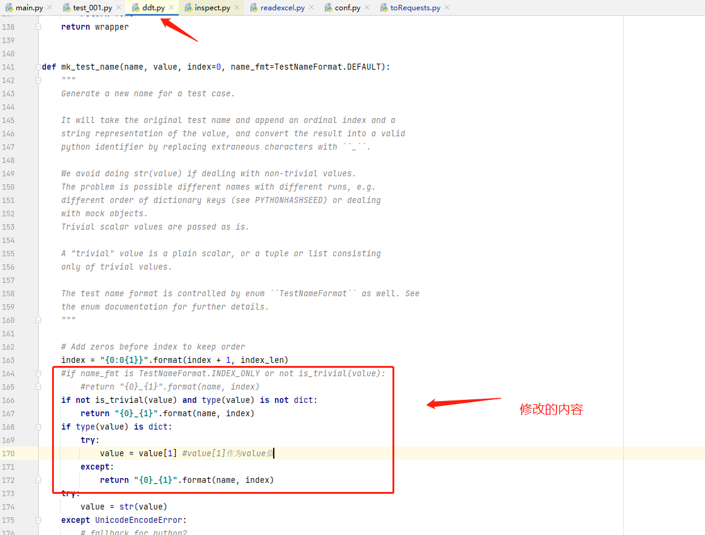
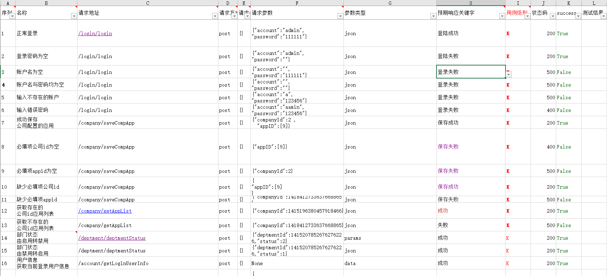
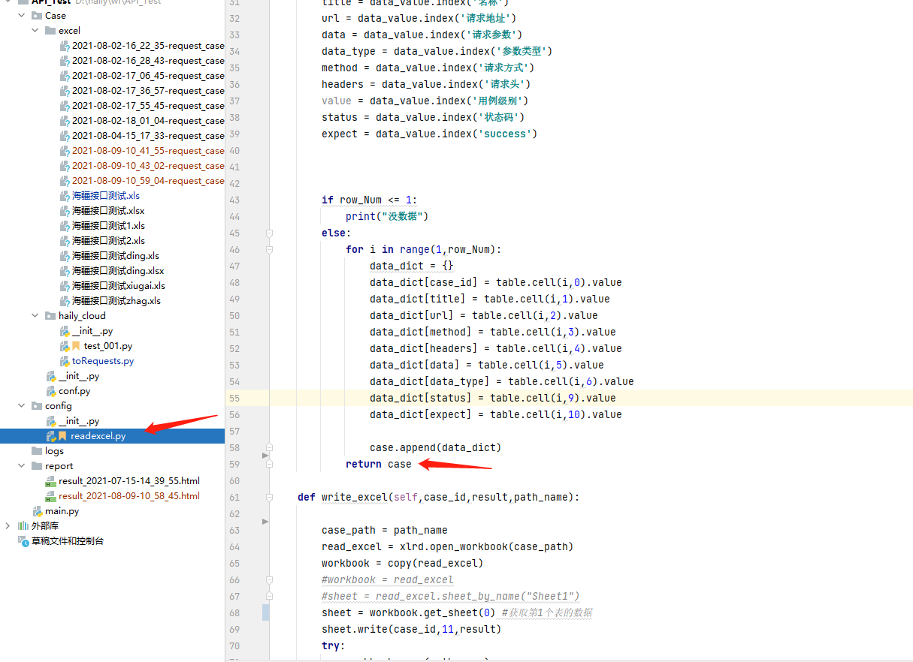
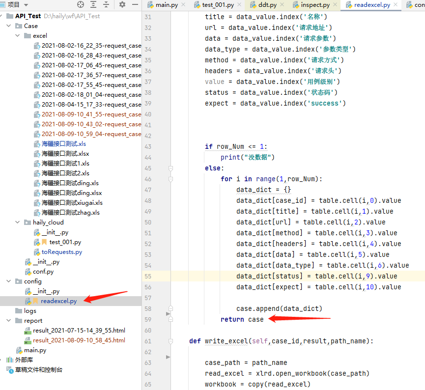
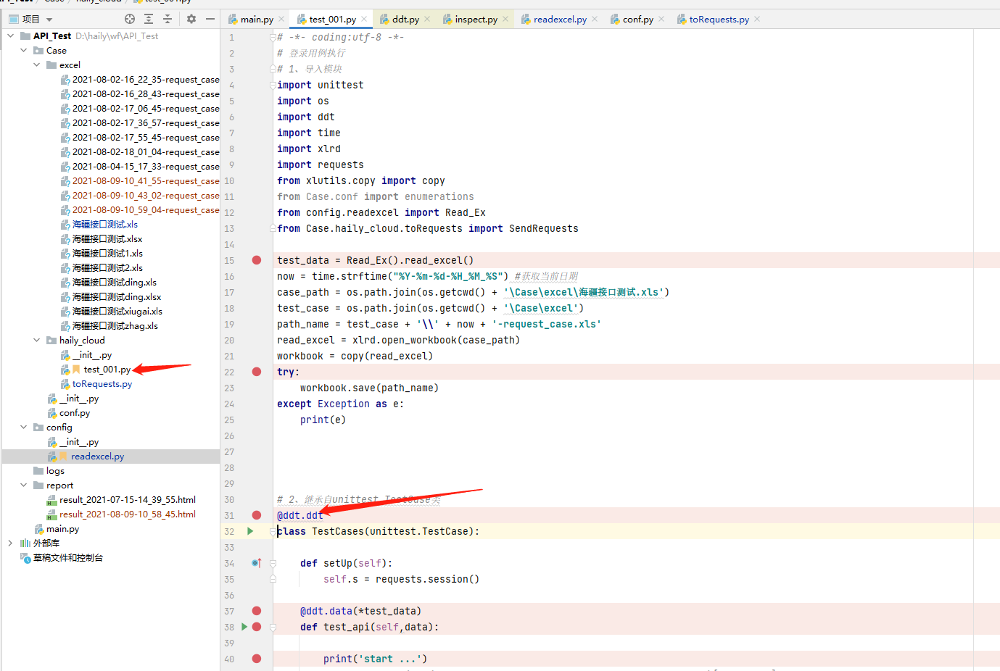
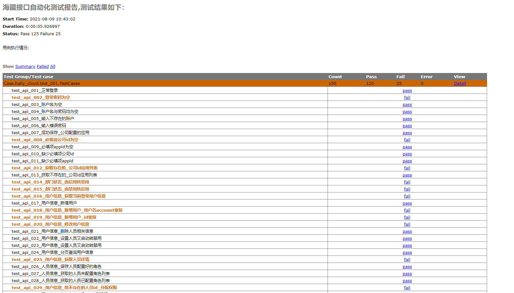
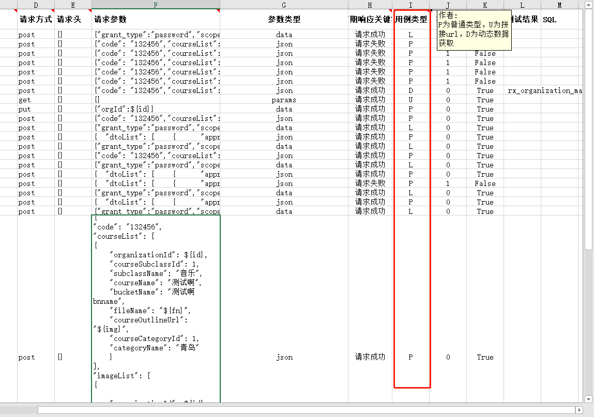
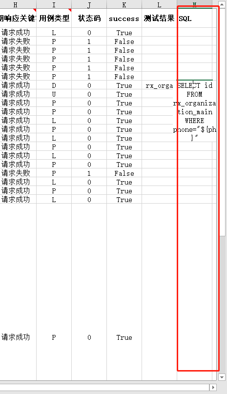

# 接口自动化测试脚本技术文档
## 概述
**此脚本采用python+requests+excel+unittest+ddt接口自动化数据驱动并生成html报告**
环境准备：

* python3.6
* requests
* xlrd
* HTMLTestRunner

## 项目结构

## 一些修改
**在安装ddt时，调用ddt时发现生成的测试报告没有显示用例名称，故在ddt内做了一些修改。**

## 测试用例格式

## xlrd读excel数据
1.先从excel里面读取测试数据，返回字典格式

## 封装request请求方法
1.把从excel读处理的数据作为请求参数，封装requests请求方法，传入请求参数，并返回结果
2.为了不污染测试的数据，出报告的时候先将测试的excel复制都应该新的excel
3.把测试返回的结果，在新的excel里面写入数据

## 测试用例unittest+ddt
1.测试用例用unittest框架组建，并用ddt数据驱动模式，批量执行用例

## 生成测试报告

## GitHub项目地址
[https://github.com/wfamzing/Test_API#apitest](https://github.com/wfamzing/Test_API#apitest)

## 对自动化接口完善的一些想法
这个脚本目前算是比较初级阶段自动化还是需要人来用编译器去执行它，后期可以完善成web端，在web端去执行，测试人员只需将心思花在用例设计上，同时还有一些功能待完善，如测试完后的数据清理模块。后期再深入自动化方面研究，可引入持续集成概念，在研发人员提交版本时自动触发编译，然后自动构建测试环境，执行自动化脚本，输出测试报告。对于这些功能实现docker容器技术是不二之选。

* * *
## 更新
### 加入动态传参

### 加入sql查询

